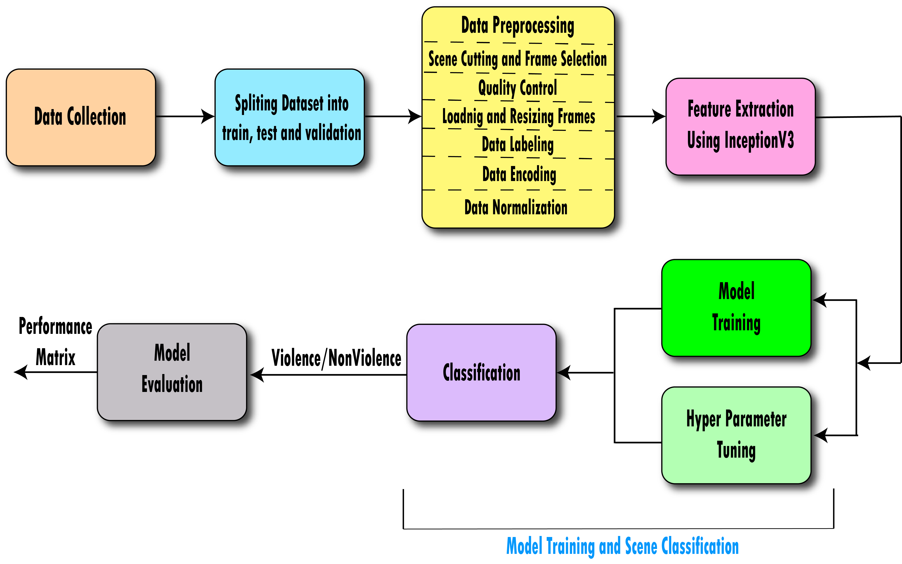

# Thesis Title : Framework for Classifying Violence and Non-Violence Content using Deep Learning Model in Films for Sensitive Viewers
This project focuses on building a system that classifies movie scenes into two categories: **Violent** & **Non-Violent** based on visual content. My system is designed to assist both **content providers** & **sensitive viewers** by detecting **violent scenes** & offering **alerts** enabling more **informed viewing decisions**. This work leverages deep learning methods to **analyze frames** from short video sequences.

## Key Objectives
### 1. Scene Classification 
The system classifies movie scenes as either violent or non-violent based on universal cinema rules focusing primarily on gory, destructive & physically violent scenes.
### 2. Motivation 
Addressing the limitations of existing methods in violence detection, this system provides a more practical & efficient solution for content filtering & classification in the context of movie scenes.

## Methodology
### 1. Data Collection 
We compiled a dataset of **600 video sequences**. 300 for violent & for 300 non-violent from **350 movies** including Bollywood, Korean & Hollywood films. Each sequence lasts **2-5 seconds** with **5 frames** manually selected from each.

### 2. Model Architecture
The system uses a **Convolutional Neural Network (CNN)** feature extractor, specifically **InceptionV3** combined with **LSTM** to capture both **spatial** & **temporal features** from movie frames.

### 3. Training and Evaluation
The dataset was split into **training**, **validation** & **testing sets** maintaining class balance. The model was trained using forward and backward propagation, with **regularization techniques** like **dropout** to **prevent overfitting**.

## Workflow
The workflow of this project is as follows:

### 1. Data Collection
A dataset of 600 video sequences (300 violent and 300 non-violent) from 350 movies including Bollywood, Korean & Hollywood films was compiled. Each sequence was 2-5 seconds long with 5 manually selected frames.

### 2. Splitting Dataset into Train, Test & Validation Sets
Once the data is collected it is split into **training**, **testing** & **validation** sets. This systematic splitting ensures balanced classes (violent and non-violent scenes) in each subset allowing for robust training and evaluation of the model.
### 3. Data Preprocessing 
During preprocessing, several important steps are performed:

- **Scene Cutting and Frame Selection**: Each video sequence is cut into specific scenes & **high-quality frames** are selected for processing.
- **Quality Control**: Ensuring that all frames meet quality standards for clear feature extraction.
- **Loading and Resizing Frames**: Frames are loaded and resized to a **consistent resolution** suitable for feature extraction.
- **Data Labeling**: Frames are labeled as **'Violence'** or **'Non-Violence'** according to their content.
- **Data Encoding**: Labels are encoded into a format suitable for model processing.
- **Data Normalization**: Frame data is normalized to standardize input features & improving the efficiency of training.

### 4. Feature Extraction Using InceptionV3
Using a **pre-trained InceptionV3 model** features are extracted from the preprocessed frames. These features capture the spatial details necessary for classifying scenes as violent or non-violent.

### 5. Model Training 
With the extracted features the model is trained. A combination of **forward propagation**, **backward propagation** & **dropout techniques** is employed to optimize the model's performance.

### 6. Hyperparameter Tuning 
The **hyperparameters** of the model are **fine-tuned** to enhance its accuracy and generalization. This process includes **optimizing parameters** like **learning rate**, **dropout rates** & **batch size**.

### 7. Classification
Once the model is trained, it classifies new scenes into **'Violence'** or **'Non-Violence'** based on the visual content of the frames.

### 8. Model Evaluation
After classification, the model is **evaluated** using **testing** and **validation data**. Metrics like **accuracy**, **loss** & **ROC curves** are used to assess its performance.

### Workflow Diagram
Below is the workflow diagram of the system, illustrating the complete process from data collection to scene classification:

  

